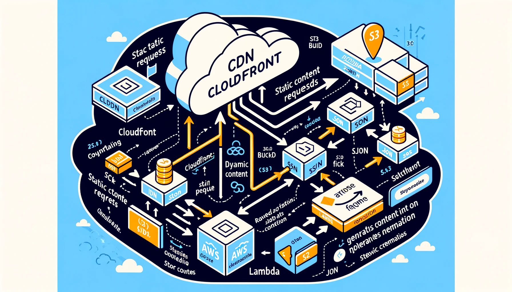

# Seamlessly Migrating Traditional JSON Servers to AWS: A Guide to Leveraging CloudFront, Lambda, and S3 for Enhanced Performance

## Introduction

In the evolving landscape of web services, organizations are continually seeking to optimize their infrastructure for performance, scalability, and cost-effectiveness. Traditional servers handling JSON data based on request parameters can pose limitations in these areas. This article introduces a modern solution that migrates such servers to a robust AWS architecture, utilizing CloudFront, AWS Lambda, and Amazon S3. This approach not only improves performance and scalability but also ensures a cost-efficient management of resources.

## Solution Overview

The proposed solution leverages AWS CloudFront as a content delivery network (CDN) to cache and serve JSON content, AWS Lambda for dynamic content generation based on request parameters, and Amazon S3 to store JSON static content. This architecture offers low latency, high availability, and reduced server load, transforming the way JSON data is served.

## Architecture Components

1. **AWS CloudFront**: Acts as the frontline, caching and serving content to users with minimal latency. CloudFront's global network of edge locations ensures content is delivered quickly, regardless of where the request originates.

2. **AWS Lambda**: Provides a serverless compute service, executing code in response to events. In this architecture, Lambda functions dynamically generate or modify JSON content based on incoming request parameters.

3. **Amazon S3**: Offers scalable storage for JSON static content. S3 serves as the origin source for CloudFront, storing the static JSON files that are infrequently updated but frequently accessed.

## Implementation Steps

### Step 1: Prepare JSON Content

- Store your static JSON content in an Amazon S3 bucket, ensuring it is structured and named for easy access and management.

### Step 2: Set Up AWS Lambda

- Create a Lambda function that can generate or modify JSON content based on request parameters. This function will act when specific CloudFront behaviors are triggered.

### Step 3: Configure AWS CloudFront

- Create a CloudFront distribution with the S3 bucket as the origin for static content.
- Define behaviors in CloudFront to route requests with specific parameters to the AWS Lambda function. This allows dynamic content generation while serving static content directly from S3.

### Step 4: Test and Optimize

- After configuration, thoroughly test the setup to ensure that static content is served from S3 and dynamic content is correctly generated by Lambda.
- Monitor performance and costs, optimizing CloudFront cache behaviors and Lambda execution times for efficiency.

## Diagram Overview

## Implementation Details

With the architectural diagram visualizing the solution, the next steps involve detailed configuration for each component. Here's a closer look:

### AWS CloudFront

- **Create a Distribution**: Set up a new CloudFront distribution, specifying your S3 bucket as the origin for static JSON files.
- **Custom Behaviors**: Define custom behaviors to route requests based on URL patterns or query parameters to the Lambda function for dynamic content generation.

### AWS Lambda

- **Function Setup**: Develop a Lambda function in your preferred runtime (e.g., Node.js, Python) that processes incoming requests, generating or modifying JSON content dynamically.
- **API Gateway Integration** (Optional): If your Lambda function needs to be triggered via HTTP(S) requests not directly supported by CloudFront, consider using API Gateway as a proxy.

### Amazon S3

- **Bucket Configuration**: Organize your static JSON content within the S3 bucket, applying naming conventions and folder structures for easy management.
- **Permissions and Policies**: Ensure the S3 bucket has the correct permissions for CloudFront to access and serve content.

## Testing and Validation

After configuration, thorough testing is crucial:

- **Static Content Delivery**: Verify that static JSON files are correctly served from the S3 bucket through CloudFront with expected caching behavior.
- **Dynamic Content Generation**: Test various request parameters to ensure the Lambda function is triggered appropriately and generates the correct JSON content.
- **Performance Monitoring**: Utilize AWS CloudWatch to monitor the performance and execution times of Lambda functions, as well as the cache hit ratio and latency of CloudFront distributions.

## Conclusion

Migrating traditional JSON servers to a serverless architecture using AWS CloudFront, Lambda, and S3 offers numerous advantages, including improved performance, scalability, and cost-efficiency. By following the steps outlined in this guide and utilizing the provided architectural diagram, organizations can seamlessly transition to a modern, serverless infrastructure capable of serving JSON content dynamically and efficiently.

This solution exemplifies how cloud technologies can transform traditional server-based architectures, paving the way for more agile, scalable, and cost-effective web services.

For further exploration and customization, AWS offers extensive documentation and community forums to assist with specific use cases and advanced configurations.
